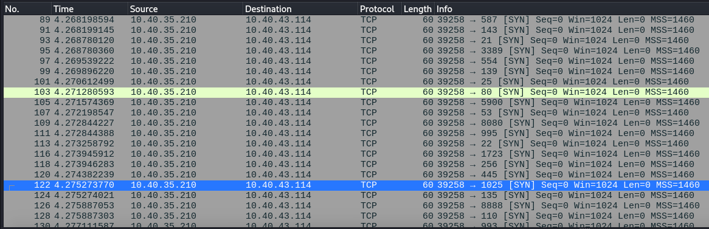

# Analyzing Nmap Scans with Wireshark

This project documents a hands-on lab exercise demonstrating how to use Nmap for network scanning and Wireshark for packet analysis. The goal is to understand what an Nmap scan looks like on the network and how to correlate scan results with actual network traffic.

---

### 1. Tools Used

* **VirtualBox:** A free and open-source hypervisor for running virtual machines.

* **Kali Linux VM:** The attacker machine, used to run the Nmap scan.

* **Debian VM:** The target machine, used to capture network traffic with Wireshark.

* **Nmap:** A powerful network discovery and security auditing tool.

* **Wireshark:** A widely-used network protocol analyzer.

* **`scp`:** A command-line utility for securely copying files over a network.

### 2. Lab Setup

A key part of this exercise is creating a secure, isolated network environment for the VMs to communicate with each other without affecting the host machine or other devices on the local network.

* Both the Kali Linux and Debian virtual machines were configured to use a **Bridged Adapter** network setting in VirtualBox. This allowed them to receive IP addresses from the local network's DHCP server, enabling them to communicate with each other.

* After booting both VMs, the IP addresses were verified using the `ip a` command on each machine.

    * **Kali VM IP:** `10.40.35.210`

    * **Debian VM IP:** `10.40.43.114`

### 3. The Nmap Scan

The objective of the Nmap scan was to identify which ports were open on the Debian target machine.

* On the Debian VM, a Wireshark capture was started on the `enp0s3` network interface to monitor all incoming traffic. No capture filter was used to ensure all packets were recorded.

* On the Kali VM, the following command was executed to perform a default Nmap scan on the target:

    ```bash
    nmap 10.40.43.114
    ```

* The Nmap results showed that only one port was open:

    ```bash
    PORT     STATE SERVICE
    22/tcp   open  ssh
    ```

### 4. Wireshark Packet Capture

After the Nmap scan was completed, the Wireshark capture on the Debian VM was stopped and saved as `nmap_scan_capture.pcapng`. This file contained all the packets sent and received during the scan.

The file was then securely transferred from the Debian VM to the Kali VM using `scp` for a closer look.

```bash
scp nmap_scan_capture.pcapng kali@10.40.35.210:/home/kali/
```

### 5. Analysis and Correlation

The captured `.pcapng` file was opened in Wireshark on the Kali machine. Display filters were used to analyze the different types of packets sent by Nmap.

* **Packets for Closed Ports:** A display filter of `ip.src == 10.40.35.210` showed many packets with the `[SYN]` flag in the "Info" column. The responses from the Debian target were immediate `[RST, ACK]` packets, which indicates a connection reset for a closed port.



* **Packets for Open Ports:** To see the traffic for the open port, a filter of `tcp.port == 22` was used. This revealed a key difference in the packet exchange:
    1.  The Kali machine sent a `[SYN]` packet to the Debian machine's port 22.
    2.  The Debian machine responded with a `[SYN, ACK]` packet, confirming that a service was listening on that port.
    3.  The Kali machine then sent a `[RST]` packet, because the default Nmap scan (a "SYN scan") does not need to complete the full three-way handshake once it confirms the port is open.

\[Add a screenshot of the Wireshark packets for the open port (Port 22), showing the SYN, SYN ACK, and RST exchange.\]

### 6. Conclusion

This lab successfully demonstrates the low-level mechanics of a simple network scan. By performing the scan and capturing the traffic simultaneously, it becomes clear how Nmap interprets packet responses to determine whether a port is open or closed. This foundational knowledge is critical for anyone in cybersecurity, as it provides a deeper understanding of network reconnaissance and firewall evasion techniques.

\[Add a screenshot of the Nmap scan results showing port 22 as open.\]